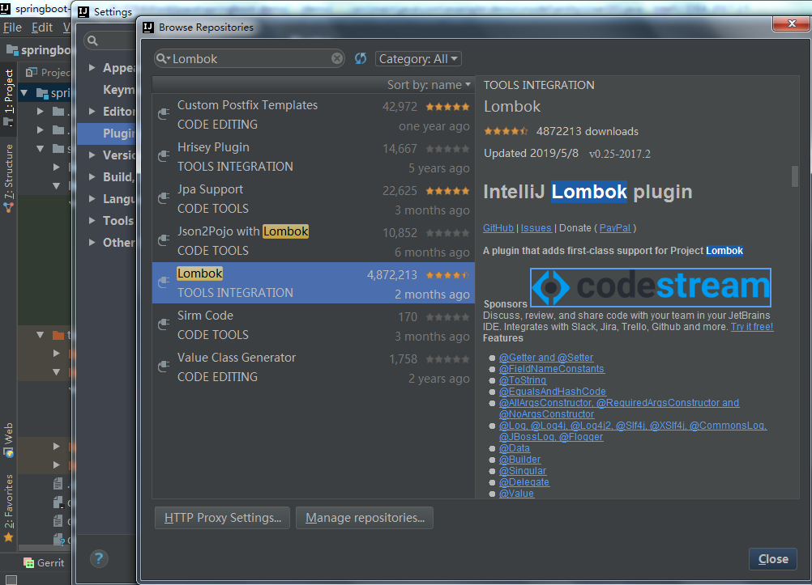

# Lombok
## Lombok的介绍  
Lombok能以简单的注解形式来简化java代码，提高开发人员的开发效率。例如开发中经常需要写的javabean，都需要花时间去添加相应的getter/setter，也许还要去写构造器、equals等方法，而且需要维护，当属性多时会出现大量的getter/setter方法，这些显得很冗长也没有太多技术含量，一旦修改属性，就容易出现忘记修改对应方法的失误。
Lombok能通过注解的方式，在编译时自动为属性生成构造器、getter/setter、equals、hashcode、toString方法。出现的神奇就是在源码中没有getter和setter方法，但是在编译生成的字节码文件中有getter和setter方法。这样就省去了手动重建这些代码的麻烦，使代码看起来更简洁些。
## 使用  
引入依赖
```
<dependency>
  <groupId>org.projectlombok</groupId>
  <artifactId>lombok</artifactId>
</dependency>
```   
### 常用注解介绍  
`@Data`:注解在类上，会为类的所有属性自动生成setter/getter、equals、canEqual、hashCode、toString方法，如为final属性，则不会为该属性生成setter方法。  
`@Getter`/`@Setter`:如果觉得`@Data`太过残暴,不够精细，可以使用此注解在属性上，可以为相应的属性自动生成Getter/Setter方法。  
`@NonNull`:该注解用在属性或构造器上，Lombok会生成一个非空的声明，可用于校验参数，能帮助避免空指针。  
```
public class NonNullExample {

  private String name;

  public NonNullExample(@NonNull String name) {
    this.name = name;
  }
}
```
`@Cleanup`:该注解能帮助我们自动调用close方法，简化代码。
```  
@Test
public void testCleanup() throws IOException {
  File file=new File("demo.log");
  @Cleanup InputStream in = new FileInputStream(file);
  @Cleanup OutputStream out = new FileOutputStream(file);
}
```  
`@EqualsAndHashCode`:使用类上，默认情况下，会使用所有非静态（non-static）和非瞬态（non-transient）属性来生成equals和hasCode，也能通过exclude注解来排除一些属性。  
`@ToString`:使用在类上，Lombok会生成一个toString()方法，默认情况下，会输出类名、所有属性（会按照属性定义顺序），用逗号来分割。  
`@NoArgsConstructor`/`@RequiredArgsConstructor`/`@AllArgsConstructor`:无参构造器、部分参数构造器、全参构造器。Lombok没法实现多种参数构造器的重载。  
`@Accessors(chain =true)`:setter方法返回当前对象。  

## IDEA相关
使用lombok可以减少我们项目代码中大量的冗余代码，比如常用的get，set，构造器方法等，虽然使用开发工具可以快速的自动生成，但如果修改了字段名称，get和set等方法需要同步进行修改，使用了lombok就不会存在这样的问题了，但在idea工具中使用lombok的时候除了项目依赖了lombok包之外，还需要安装lombok插件，要不然在idea中显示有编译错误的红色标记，虽然不影响代码的执行，但影响代码的阅读。安装步骤如下
> File -> Setting...-> Plugins -> Browse repositories... -> 搜索输入Lombok -> 选择Lombok插件 -> 点击Install进行安装 -> 重启IDEA
>下图是已经安装好的：  

## Lombok的优缺点  
优点：  
1. 能通过注解的形式自动生成构造器、getter/setter、equals、hashcode、toString等方法，提高了一定的开发效率  
2. 让代码变得简洁，不用过多的去关注相应的方法  
3. 属性做修改时，也简化了维护为这些属性所生成的getter/setter方法等   

缺点：  
1. 不支持多种参数构造器的重载  
2. 虽然省去了手动创建getter/setter方法的麻烦，但大大降低了源代码的可读性和完整性，降低了阅读源代码的舒适度  

## 总结  
Lombok不像spring的依赖注入或者mybatis的ORM是运行时的特性，而是编译时的特性，而且还要依赖插件。Lombok只是省去了一些人工生成代码的麻烦，但IDE都有快捷键来协助生成getter/setter等方法，也非常方便。  
虽然非常不建议在属性的getter/setter写一些业务代码，但在多年项目的实战中，有时通过给getter/setter加一点点业务代码，能极大的简化某些业务场景的代码。所谓取舍，也许就是这时的舍弃一定的规范，取得极大的方便。  
Lombok有它的得天独厚的优点，也有它避之不及的缺点，熟知其优缺点，在实战中灵活运用才是王道。
