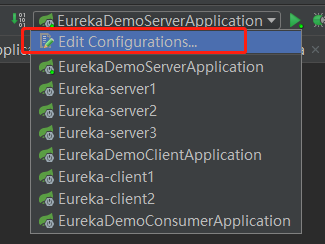

# Eureka
## Eureka Server
### 创建项目引入依赖
创建SpringBoot项目,创建后，pom文件部分内容：  
```
<parent>
  <groupId>org.springframework.boot</groupId>
  <artifactId>spring-boot-starter-parent</artifactId>
  <version>2.1.6.RELEASE</version>
  <relativePath/>
</parent>

<properties>
  <java.version>1.8</java.version>
  <spring-cloud.version>Greenwich.SR2</spring-cloud.version>
</properties>

<dependencies>
  <dependency>
    <groupId>org.springframework.cloud</groupId>
    <artifactId>spring-cloud-starter-netflix-eureka-server</artifactId>
  </dependency>
</dependencies>

<dependencyManagement>
  <dependencies>
    <dependency>
      <groupId>org.springframework.cloud</groupId>
      <artifactId>spring-cloud-dependencies</artifactId>
      <version>${spring-cloud.version}</version>
      <type>pom</type>
      <scope>import</scope>
    </dependency>
  </dependencies>
</dependencyManagement>

<build>
  <plugins>
    <plugin>
      <groupId>org.springframework.boot</groupId>
      <artifactId>spring-boot-maven-plugin</artifactId>
    </plugin>
  </plugins>
</build>
```  
### 开启注册中心
为启动类添加`@EnableEurekaServer`注解开启Eureka注册中心：
```  
@SpringBootApplication
@EnableEurekaServer
public class EurekaDemoServerApplication {
	public static void main(String[] args) {
		SpringApplication.run(EurekaDemoServerApplication.class, args);
	}
}
```
### 添加配置  
需要注意的属性：
>`eureka.client.register-with-eureka`：表示是否将自己注册在EurekaServer上，默认为true。单个实例时设置为false，多个实例时设置为true。  
>`eureka.client.fetch-registry`：表示表示是否从EurekaServer获取注册信息，默认为true。单个实例时设置为false，多个实例时设置为true。  
>`eureka.server.enable-self-preservation`：默认为true，自我保护模式是一种应对网络异常的安全保护措施，比如因为网络问题，Eureka没有接收到微服务的心跳，但实际上该微服务是健康的。它的架构哲学是宁可同时保留所有微服务（健康和健康的），也不盲目注销任何健康的微服务。使用自我保护模式，可以让Eureka集群更加的健壮、稳定，所以一般都要开启。  
>`spring.cloud.inetutils.timeout-seconds`：分布式应用部署到服务上，由于服务器可能存在多张网卡，造成IP地址不准的问题。该属性默认为1s，考虑到网络问题，默认时间可能太短导致处理超时，需要配置大一点。


#### 单个实例配置  
```
spring.application.name=eureka-server
server.port=8066

eureka.instance.hostname=localhost

eureka.client.register-with-eureka=false
eureka.client.fetch-registry=false
eureka.client.serviceUrl.defaultZone=http://${eureka.instance.hostname}:${server.port}/eureka/
```
#### 多个实例配置
节点1配置：
```
spring.application.name=eureka-server
server.port=8067

eureka.client.register-with-eureka=true
eureka.client.fetch-registry=true
eureka.instance.hostname=master
eureka.client.serviceUrl.defaultZone=http://backup1:8068/eureka/,http://backup2:8069/eureka/
```
节点2配置：
```
spring.application.name=eureka-server
server.port=8068

eureka.client.register-with-eureka=true
eureka.client.fetch-registry=true
eureka.instance.hostname=backup1
eureka.client.serviceUrl.defaultZone=http://master:8067/eureka/,http://backup2:8069/eureka/
```
节点3配置：
```
spring.application.name=eureka-server
server.port=8069

eureka.client.register-with-eureka=true
eureka.client.fetch-registry=true
eureka.instance.hostname=backup2
eureka.client.serviceUrl.defaultZone=http://master:8067/eureka/,http://backup1:8068/eureka/
```
hosts文件最后添加：
```
127.0.0.1 master backup1 backup2
```  
以上是三个节点在本地配置测试时的配置。
#### 多实例配置注意事项  
##### 配置更多节点
需要修改以下属性：  
`server.port`:可用端口号  
`eureka.instance.hostname`:eureka服务主机的名称。配置hosts文件后通过hostname映射到相应的ip。为了能更好的分辨各个节点，每个节点的hostname都应该不一样。  
`eureka.client.serviceUrl.defaultZone`:此处填写其它节点的注册中心地址，英文逗号分隔，格式为**http://(eureka.instance.hostname):(server.port)/eureka/** ，其中的属性值是其它节点配置文件中的值。  
##### 节点均出现在unavailable-replicas下的解决方案  
1. `eureka.client.serviceUrl.defaultZone`配置项的地址，不能使用localhost，要使用域名，hosts或者DNS解析请自行配置。
2. `spring.application.name`要一致，个人测试不配置亦可。
3. `eureka.client.register-with-eureka`和`eureka.client.fetch-registry`必须为true，个人测试不配置有时可以有时不可以，尽量配上。ps：有时候可能因为是旧版本的问题，这两项必须配置而且属性名称得改为驼峰式（`eureka.client.registerWithEureka`和`eureka.client.fetchRegistry`）。  
4. 配置`eureka.instance.hostname`且各节点别出现重复名称，另外也要注意配置各节点的hosts。
5. `eureka.instance.prefer-ip-address`配置为false。`prefer-ip-address=true`作用是不使用主机名，而是使用IP地址的方式来定义注册中心的地址，而defaultZone中是以域名的方式向注册中心注册的（测试了下使用IP注册到备份节点不可识别），最终导致分片节点不能识别匹配（IP地址与域名），而认为分片均处于不可达状态。（测试中未出现该情况，待验证）

## Eureka Client  
### 创建项目引入依赖  
创建SpringBoot项目,创建后，pom文件部分内容：
```
<parent>
    <groupId>org.springframework.boot</groupId>
    <artifactId>spring-boot-starter-parent</artifactId>
    <version>2.1.6.RELEASE</version>
    <relativePath/>
  </parent>

  <properties>
    <java.version>1.8</java.version>
    <spring-cloud.version>Greenwich.SR2</spring-cloud.version>
  </properties>

  <dependencies>
    <dependency>
      <groupId>org.springframework.cloud</groupId>
      <artifactId>spring-cloud-starter-netflix-eureka-client</artifactId>
    </dependency>
    <dependency>
      <groupId>org.springframework.boot</groupId>
      <artifactId>spring-boot-starter-web</artifactId>
    </dependency>
  </dependencies>

  <dependencyManagement>
    <dependencies>
      <dependency>
        <groupId>org.springframework.cloud</groupId>
        <artifactId>spring-cloud-dependencies</artifactId>
        <version>${spring-cloud.version}</version>
        <type>pom</type>
        <scope>import</scope>
      </dependency>
    </dependencies>
  </dependencyManagement>

  <build>
    <plugins>
      <plugin>
        <groupId>org.springframework.boot</groupId>
        <artifactId>spring-boot-maven-plugin</artifactId>
      </plugin>
    </plugins>
  </build>  
```  
### 启动发现服务  
为启动类添加`@EnableEurekaClient`或`@EnableDiscoveryClient`发现服务。  
`@EnableDiscoveryClient`注解是基于spring-cloud-commons依赖，实现了eureka, consul, zookeeper；  
`@EnableEurekaClient`注解是基于spring-cloud-netflix依赖，只能为eureka作用；  
两者作用一样，使用Eureka作为注册中心时推荐用`@EnableEurekaClient`  
```
@SpringBootApplication
@EnableEurekaClient//推荐使用这个
//@EnableDiscoveryClient
public class EurekaDemoClientApplication {

  public static void main(String[] args) {
    SpringApplication.run(EurekaDemoClientApplication.class, args);
  }

}
```  
### 添加配置  
服务1配置：
```
spring.application.name=eureka-client1
server.port=8078

eureka.client.serviceUrl.defaultZone=http://master:8066/eureka/
```  
服务2配置：
```
spring.application.name=eureka-client2
server.port=8079

eureka.client.serviceUrl.defaultZone=http://master:8066/eureka/
```
`spring.application.name`是服务名称  
`eureka.client.serviceUrl.defaultZone`填写注册中心的地址，注册中心是集群的时候填写多个，用英文逗号隔开。
### 服务Controler  
方法返回当前应用的服务名称和端口。  
```
@RestController
public class ProvidController {

  @Autowired
  private Registration registration;

  @GetMapping("/provid")
  public String index() {
    return registration.getServiceId() + "--" + registration.getPort();
  }

}
```
## Eureka Consumer  
### 创建任务引入依赖
```
<parent>
  <groupId>org.springframework.boot</groupId>
  <artifactId>spring-boot-starter-parent</artifactId>
  <version>2.1.6.RELEASE</version>
  <relativePath/> <!-- lookup parent from repository -->
</parent>

<properties>
  <java.version>1.8</java.version>
  <spring-cloud-services.version>2.1.4.RELEASE</spring-cloud-services.version>
  <spring-cloud.version>Greenwich.SR2</spring-cloud.version>
</properties>

<dependencies>
  <dependency>
    <groupId>org.springframework.cloud</groupId>
    <artifactId>spring-cloud-starter-netflix-eureka-client</artifactId>
  </dependency>
  <dependency>
    <groupId>org.springframework.cloud</groupId>
    <artifactId>spring-cloud-starter-openfeign</artifactId>
  </dependency>
  <dependency>
    <groupId>org.springframework.boot</groupId>
    <artifactId>spring-boot-starter-web</artifactId>
  </dependency>
</dependencies>

<dependencyManagement>
  <dependencies>
    <dependency>
      <groupId>org.springframework.cloud</groupId>
      <artifactId>spring-cloud-dependencies</artifactId>
      <version>${spring-cloud.version}</version>
      <type>pom</type>
      <scope>import</scope>
    </dependency>
    <dependency>
      <groupId>io.pivotal.spring.cloud</groupId>
      <artifactId>spring-cloud-services-dependencies</artifactId>
      <version>${spring-cloud-services.version}</version>
      <type>pom</type>
      <scope>import</scope>
    </dependency>
  </dependencies>
</dependencyManagement>

<build>
  <plugins>
    <plugin>
      <groupId>org.springframework.boot</groupId>
      <artifactId>spring-boot-maven-plugin</artifactId>
    </plugin>
  </plugins>
</build>
```
### 启用Feign服务   
启动类添加`@EnableFeignClients`注解启用Feign服务
```
@SpringBootApplication
@EnableFeignClients
public class EurekaDemoConsumerApplication {

	public static void main(String[] args) {
		SpringApplication.run(EurekaDemoConsumerApplication.class, args);
	}

}
```
### 添加配置  
```
spring.application.name=eureka-consumer
server.port=8080

eureka.client.serviceUrl.defaultZone=http://master:8066/eureka/
```
`eureka.client.serviceUrl.defaultZone`填写注册中心的地址，注册中心是集群的时候填写多个，用英文逗号隔开。  
有时候因为网络问题，超时时间又太短，可能会获取服务失败。可以添加一下属性改善：
```
feign.client.config.default.connectTimeout=60000
feign.client.config.default.readTimeout=60000
feign.client.config.default.loggerLevel=basic
```
### Feign服务接口  
服务接口1：
```
@FeignClient("eureka-client1")
public interface FeignService1 {
  @GetMapping("/provid")
  String consume();
}
```
服务接口2：
```
@FeignClient("eureka-client2")
public interface FeignService2 {
  @GetMapping("/provid")
  String consume();
}
```
`@FeignClient`里的属性值对应需要调用的服务的服务名称；
`***Mapping`里的路径对应要调用的服务的Controller相应方法的路径；
**参数** 和 **返回值** 对应要调用的服务的Controller相应方法的参数和返回值。
### 测试Controller  
```
@RestController
public class ConsumController {

  @Autowired
  private FeignService1 feignService1;

  @Autowired
  private FeignService2 feignService2;

  @GetMapping("/consume/{node}")
  public String consume(@PathVariable String node) {
    if ("1".equals(node)) {
      return feignService1.consume();
    } else if ("2".equals(node)) {
      return feignService2.consume();
    } else {
      return "nothing";
    }
  }
}
```
## 测试
### 启动多节点测试  
先说说怎样同一个项目启动多个应用进行测试  
1、打开设置  
  
2、选择应用并点击复制  
  
3、修改属性  
修改名称是为了区分  
添加启动属性用于读取指定配置文件，`-Dspring.profiles.active=value`作用是读取名称带有**value**的配置文件
  
4、分别启动即可
### Server
启动后输入相应的 **http://${eureka.instance.hostname}:${server.port}/** 即可访问注册中心。
#### 单节点  
本次测试使用的是单节点，除了展示使用多节点时的页面外，其他的注册中心的页面都是单节点时的页面。
  
#### 多节点
其中一个注册中心，其它节点的类似。
  
### Client
启动注册中心应用后分别启动服务，服务注册成功后，注册中心页面如下。  

### Consumer  
启动注册中心应用，服务注册成功后，即可获取服务并调用，此时注册中心页面如下。  
  
访问测试Controller调用分别调用服务，可以看到相应的服务名称和端口号  
调用服务1：  
  
调用服务2：  
  

**至此测试完毕**
